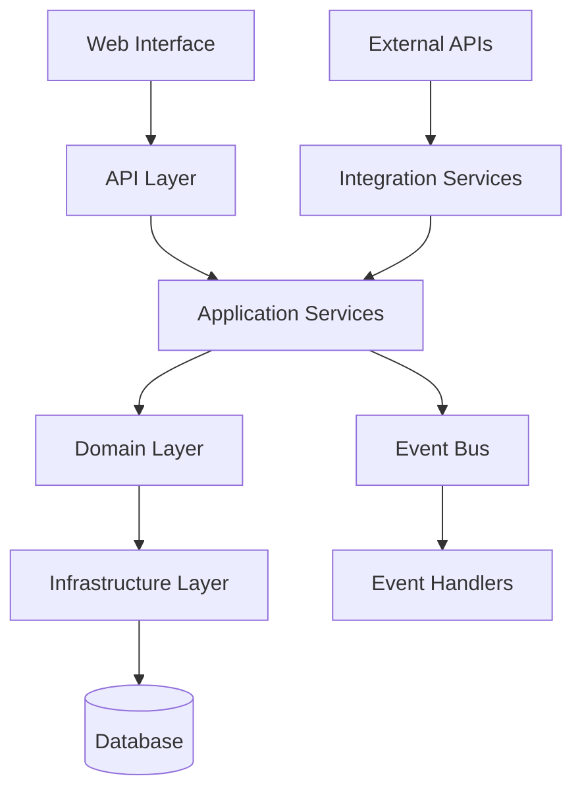

# Design Document

## Overview

The Personal Life Dashboard is designed as a modular monolith "Life OS" that serves as a user's personal command center for holistic life management. The system combines RPG-inspired gamification with real-world data integration to create a comprehensive platform that grows in value with usage. The architecture follows Domain-Driven Design principles to ensure scalability, maintainability, and future extensibility.

## Architecture

### High-Level Architecture



### Bounded Contexts

The system is organized into eight bounded contexts, each with clear responsibilities:

#### 1. Stats Context
**Purpose**: Core RPG stats and life metrics tracking
**Domain Entities**:
- `CoreStat` (Strength, Endurance, Agility, Intelligence, Wisdom, Charisma)
- `LifeStat` (Health, Wealth, Relationships subcategories)
- `StatHistory` (Historical tracking and trends)

**Key Services**:
- `StatService`: Update stats, calculate levels, manage XP
- `TrendAnalysisService`: Generate insights and correlations
- `IntegrationSyncService`: Sync with external data sources

#### 2. Integrations Context
**Purpose**: External API connections and data synchronization
**Domain Entities**:
- `Integration` (Health, Finance, Productivity connections)
- `SyncJob` (Scheduled synchronization tasks)
- `ExternalDataPoint` (Raw external data)

**Key Services**:
- `IntegrationService`: Manage API connections
- `DataSyncService`: Orchestrate data synchronization
- `ValidationService`: Validate and transform external data

#### 3. Quests Context
**Purpose**: Goal management and habit tracking
**Domain Entities**:
- `Quest` (Life Goals, Annual, Main, Side, Weekly, Daily)
- `Habit` (Recurring behaviors with frequency)
- `QuestChain` (Linked quest progressions)

**Key Services**:
- `QuestService`: Create, update, complete quests
- `HabitScheduler`: Manage recurring habits and streaks
- `AutoCompletionService`: Handle automatic quest completion

#### 4. Skills Context
**Purpose**: Skill development and mastery tracking
**Domain Entities**:
- `Skill` (Individual skills with leveling)
- `SkillCategory` (Health, Wealth, Social groupings)
- `SkillTree` (Prerequisite relationships)

**Key Services**:
- `SkillService`: Level skills, award XP, manage prerequisites
- `MasteryCalculator`: Determine skill mastery levels
- `RecommendationEngine`: Suggest skill development paths

#### 5. Achievements Context
**Purpose**: Recognition and milestone system
**Domain Entities**:
- `Achievement` (Bronze, Silver, Gold tiers)
- `Title` (Unlockable user titles)
- `Badge` (Visual recognition elements)

**Key Services**:
- `AchievementEngine`: Evaluate rules and unlock achievements
- `TitleService`: Manage title unlocks and display
- `RecognitionService`: Handle celebrations and notifications

#### 6. Journals Context
**Purpose**: Personal reflection and insight capture
**Domain Entities**:
- `JournalEntry` (Daily, Weekly, Milestone, Insight types)
- `GeneratedInsight` (AI-generated patterns and insights)
- `ReflectionPrompt` (Suggested reflection topics)

**Key Services**:
- `JournalService`: Create and manage entries
- `InsightEngine`: Generate insights from entries and data
- `ReflectionPromptService`: Suggest reflection topics

#### 7. Analytics Context
**Purpose**: Intelligence, predictions, and pattern analysis
**Domain Entities**:
- `TrendAnalysis` (Statistical analysis of patterns)
- `Prediction` (Forecasted outcomes)
- `BalanceScore` (Life area equilibrium metrics)

**Key Services**:
- `AnalyticsService`: Generate insights and predictions
- `PatternDetectionService`: Identify behavioral patterns
- `BalanceCalculator`: Assess life area balance

#### 8. Dashboard Context
**Purpose**: Central coordination and user management
**Domain Entities**:
- `UserProfile` (Central user data and preferences)
- `DashboardWidget` (Configurable dashboard components)
- `Notification` (System notifications and alerts)

**Key Services**:
- `DashboardService`: Aggregate data from all contexts
- `NotificationService`: Manage alerts and celebrations
- `UserService`: Handle authentication and profile management

### Domain Events

The system uses domain events for loose coupling between contexts. All events follow the canonical schema defined in [Domain Events Catalog](../../steering/domain-events-catalog.md).

```python
# Import canonical events from catalog
from life_domain.events import (
    # Core Events
    QuestCompleted,
    HabitStreakAchieved,
    SkillLevelUp,
    AchievementUnlocked,
    StatMilestoneReached,
    ExperienceAwarded,
    LevelUp,

    # Integration Events
    ExternalDataReceived,
    DataSyncCompleted,
    AutoCompletionTriggered,

    # Intelligence Events
    PatternDetected,
    InsightGenerated,
    RecommendationCreated,
    BalanceShiftDetected,
    PredictionGenerated
)

# Example canonical event usage
@dataclass
class QuestCompleted(BaseEvent):
    """Quest completion event - v1.0.0"""
    user_id: int
    quest_id: int
    quest_type: str
    experience_reward: int
    completion_timestamp: datetime
    auto_completed: bool
    version: str = "1.0.0"

@dataclass
class ExternalDataReceived(BaseEvent):
    """External data sync event - v1.0.0"""
    user_id: int
    integration_id: int
    data_type: str
    data_points_count: int
    sync_timestamp: datetime
    data_quality_score: float
    version: str = "1.0.0"
```

## Components and Interfaces

### Web Interface Layer

#### Dashboard Views
- **Home Dashboard**: Central command center with key metrics, active quests, recent achievements
- **Stats Overview**: Core stats display with level progression and XP tracking
- **Life Stats Dashboard**: Health, Wealth, Relationships metrics with trend visualization
- **Quest Log**: Multi-level quest management interface
- **Skills Tree**: Visual skill progression and development paths
- **Achievement Gallery**: Badge collection and title display
- **Journal Interface**: Entry creation and insight viewing
- **Integrations Panel**: External service connection management

#### API Endpoints
```python
# RESTful API structure
/api/v1/stats/
    GET /core-stats/{user_id}
    PUT /core-stats/{user_id}
    GET /life-stats/{user_id}
    PUT /life-stats/{user_id}
    GET /trends/{user_id}

/api/v1/integrations/
    GET /integrations/{user_id}
    POST /integrations/
    PUT /integrations/{integration_id}/sync
    DELETE /integrations/{integration_id}

/api/v1/quests/
    GET /quests/{user_id}
    POST /quests/
    PUT /quests/{quest_id}/complete
    GET /habits/{user_id}
    POST /habits/{habit_id}/complete

/api/v1/skills/
    GET /skills/{user_id}
    POST /skills/{skill_id}/practice
    GET /categories/
    GET /recommendations/{user_id}

/api/v1/achievements/
    GET /achievements/{user_id}
    GET /available-achievements/

/api/v1/journal/
    GET /entries/{user_id}
    POST /entries/
    GET /insights/{user_id}

/api/v1/analytics/
    GET /trends/{user_id}
    GET /predictions/{user_id}
    GET /balance-score/{user_id}
```

### Integration Layer

#### External Data Sources
- **Health**: Apple Health, Google Fit, Strava, Oura Ring, sleep trackers
- **Wealth**: Banking APIs, investment platforms, expense tracking apps
- **Productivity**: Todoist, Notion, calendar integrations
- **Social**: Email analytics, social media metrics

#### Integration Services
```python
class HealthIntegrationService:
    def sync_workout_data(self, user_id: int) -> None
    def sync_sleep_data(self, user_id: int) -> None
    def sync_nutrition_data(self, user_id: int) -> None

class WealthIntegrationService:
    def sync_bank_data(self, user_id: int) -> None
    def sync_investment_data(self, user_id: int) -> None
    def calculate_net_worth(self, user_id: int) -> Decimal

class ProductivityIntegrationService:
    def sync_task_data(self, user_id: int) -> None
    def auto_complete_quests(self, user_id: int, completed_tasks: List[Task]) -> None
```

## Data Models

### Core Stat Model
```python
class CoreStat:
    user_id: int
    strength: int = 10
    endurance: int = 10
    agility: int = 10
    intelligence: int = 10
    wisdom: int = 10
    charisma: int = 10
    experience_points: int = 0
    level: int = 1

    def add_experience(self, points: int) -> None
    def calculate_level(self) -> int
```

### Life Stat Model
```python
class LifeStat:
    user_id: int
    category: LifeStatCategory  # Health, Wealth, Relationships
    subcategory: str
    current_value: Decimal
    target_value: Optional[Decimal]
    unit: str
    last_updated: datetime
    data_source: str  # manual, integration

    def update_value(self, new_value: Decimal, source: str) -> None
    def calculate_progress(self) -> float
```

### Integration Model
```python
class Integration:
    user_id: int
    integration_type: IntegrationType  # Health, Wealth, Productivity
    service_name: str  # Strava, Plaid, Todoist
    credentials: dict  # Encrypted credentials
    sync_frequency: str  # hourly, daily, weekly
    last_sync: Optional[datetime]
    is_active: bool

    def sync_data(self) -> SyncResult
    def test_connection(self) -> bool
```

### Quest Model
```python
class Quest:
    user_id: int
    title: str
    description: str
    quest_type: QuestType  # Life, Annual, Main, Side, Weekly, Daily
    difficulty: Difficulty  # Easy, Medium, Hard
    status: QuestStatus  # Active, Completed, Failed
    experience_reward: int
    due_date: Optional[date]
    parent_quest_id: Optional[int]  # For quest chains
    auto_completion_rules: List[AutoCompletionRule]

    def complete(self) -> QuestCompleted
    def check_auto_completion(self, external_data: dict) -> bool
```

## Error Handling

### Domain-Level Validation
- Value objects enforce business rules (e.g., stat values 1-100)
- Domain services validate complex business logic
- Custom exceptions for domain violations

### Application-Level Error Handling
- Service layer catches domain exceptions
- Converts to appropriate HTTP responses
- Logs errors for monitoring and debugging

### Infrastructure-Level Resilience
- Database connection retry logic
- External API timeout and fallback handling
- Graceful degradation when integrations fail
- Circuit breaker pattern for external services

### Integration Error Handling
```python
class IntegrationErrorHandler:
    def handle_api_failure(self, integration: Integration, error: Exception):
        # Log error, disable integration temporarily
        # Notify user of sync failure
        # Schedule retry with exponential backoff
        pass

    def handle_data_validation_error(self, data: dict, error: ValidationError):
        # Log invalid data
        # Continue processing valid data points
        # Alert user to data quality issues
        pass
```

## Testing Strategy

### Domain Layer Testing
```python
# Pure unit tests for business logic
def test_stat_level_calculation():
    stat = CoreStat(experience_points=1500)
    assert stat.calculate_level() == 2

def test_quest_completion_awards_xp():
    quest = Quest(experience_reward=100)
    event = quest.complete()
    assert event.experience_reward == 100
```

### Application Layer Testing
```python
# Integration tests for service orchestration
def test_quest_completion_flow():
    quest_service = QuestService()
    stat_service = StatService()

    quest_service.complete_quest(user_id=1, quest_id=1)

    # Verify XP was awarded
    stats = stat_service.get_user_stats(user_id=1)
    assert stats.experience_points > 0

def test_integration_sync_flow():
    integration_service = IntegrationService()
    stat_service = StatService()

    integration_service.sync_health_data(user_id=1)

    # Verify stats were updated from external data
    stats = stat_service.get_user_stats(user_id=1)
    assert stats.last_updated > initial_timestamp
```

### Interface Layer Testing
```python
# Django view and API tests
def test_complete_quest_endpoint(client):
    response = client.put('/api/v1/quests/1/complete')
    assert response.status_code == 200
    assert response.json()['status'] == 'completed'

def test_integration_sync_endpoint(client):
    response = client.put('/api/v1/integrations/1/sync')
    assert response.status_code == 200
    assert 'sync_timestamp' in response.json()
```

### BDD Feature Testing
```gherkin
# features/life_os_workflow.feature
Feature: Complete Life OS Workflow
  As a user managing my personal development
  I want a seamless experience across all life areas
  So that I can track holistic progress

  Scenario: Daily life management workflow
    Given I am logged into my Life OS dashboard
    When I sync my health data from my fitness tracker
    And I complete my morning habits
    And I work on my active skills
    Then my stats should update across all categories
    And I should see updated insights on my dashboard
    And any achieved milestones should unlock achievements
    And my daily quest progress should reflect the activities

  Scenario: Integration failure graceful handling
    Given I have active external integrations
    When an external API becomes unavailable
    Then I should receive a notification about the sync failure
    And I should be able to manually enter data as fallback
    And the system should retry the sync automatically
    And my experience should not be significantly impacted

# features/external_integrations.feature
Feature: External Data Integration
  As a user who wants automated stat tracking
  I want to connect external services
  So that my stats update automatically

  Scenario: Successful health data sync
    Given I have connected my fitness tracker
    When I complete a workout
    Then my strength and endurance stats should increase
    And I should receive XP for the activity
    And relevant achievements should be evaluated

  Scenario: Quest auto-completion from productivity sync
    Given I have connected my task manager
    And I have an active quest "Complete 5 work tasks"
    When I mark 5 tasks as complete in my task manager
    Then the quest should be automatically completed
    And I should receive the quest reward
    And my productivity stats should update

# features/insight_generation.feature
Feature: AI-Powered Insights
  As a user tracking multiple life areas
  I want to receive intelligent insights
  So that I can make better decisions

  Scenario: Pattern detection and recommendations
    Given I have been tracking my stats for 30 days
    When the system analyzes my patterns
    Then I should receive insights about correlations
    And I should get personalized recommendations
    And the insights should be actionable and specific
```

## Performance Considerations

### Caching Strategy
- Redis caching for frequently accessed user data
- Dashboard aggregations cached with TTL
- Event-driven cache invalidation
- Integration data caching to reduce API calls

### Database Optimization
- Proper indexing on user_id and timestamp fields
- Partitioning for historical data
- Read replicas for analytics queries
- Connection pooling for high concurrency

### Async Processing
- Celery tasks for heavy computations
- Background sync of external data
- Async event processing for non-critical updates
- Queue management for integration sync jobs

### Integration Performance
- Rate limiting compliance with external APIs
- Batch processing for bulk data sync
- Intelligent sync scheduling based on data freshness
- Circuit breaker pattern for failing integrations

## Security

### Authentication & Authorization
- Django's built-in authentication system
- Session-based authentication for web interface
- JWT tokens for API access
- OAuth2 for external service integrations
- Role-based permissions (future: family/team sharing)

### Data Protection
- Encryption at rest for sensitive data
- Encrypted storage of integration credentials
- HTTPS enforcement
- Input validation and sanitization
- Rate limiting on API endpoints

### Integration Security
- Secure credential storage with encryption
- OAuth2 flow for external service authorization
- API key rotation and management
- Audit logging for external data access

### Privacy
- User data isolation
- GDPR compliance features (data export/deletion)
- Audit logging for data access
- Anonymization for analytics and insights

## Scalability Path

### Horizontal Scaling
- Stateless application servers
- Database read replicas
- CDN for static assets
- Load balancing with session affinity
- Distributed caching with Redis Cluster

### Microservice Evolution
- Clear context boundaries enable service extraction
- Event-driven architecture supports distributed systems
- API-first design facilitates service decomposition
- Shared data models can be extracted to service contracts

### Integration Scaling
- Dedicated integration service workers
- Queue-based processing for sync jobs
- Horizontal scaling of integration processors
- Caching layer for external API responses

### Business Logic Layer

### Core Domain Rules Implementation

The business logic layer implements the value-to-tech traceability established in the Business Logic Blueprint:

#### Level-Up Rules
```python
# stats/domain/services.py
class LevelCalculationService:
    def calculate_level_up(self, experience_points: int) -> LevelUpResult:
        # Every 1000 XP = 1 level, with difficulty curve increase
        new_level = (experience_points // 1000) + 1
        if new_level > current_level:
            return LevelUpResult(
                new_level=new_level,
                difficulty_multiplier=1.1 ** new_level,
                celebration_tier="major"
            )
```

#### Habit Streak Rules
```python
# quests/domain/services.py
class StreakCalculationService:
    def calculate_streak_bonus(self, streak_count: int) -> StreakBonus:
        # 21+ day streaks get bonus XP, 100+ days get titles
        if streak_count >= 100:
            return StreakBonus(xp_multiplier=3.0, title="Habit Master")
        elif streak_count >= 21:
            return StreakBonus(xp_multiplier=2.0, achievement="Streak Warrior")
        return StreakBonus(xp_multiplier=1.0)
```

#### Achievement Evaluation Rules
```python
# achievements/domain/services.py
class AchievementEvaluationService:
    def evaluate_achievement_rules(self, user_context: UserContext) -> List[Achievement]:
        # Dynamic rule evaluation based on user progress
        eligible_achievements = []
        for rule in self.achievement_rules:
            if rule.evaluate(user_context):
                eligible_achievements.append(rule.achievement)
        return eligible_achievements
```

## User Experience & Gamification Layer

### UX Design Principles

#### RPG-Inspired Interface
- **Character Sheet Aesthetic**: Dashboard resembles RPG character screen with stats, level, and progress bars
- **Quest Log Design**: Familiar RPG quest interface with categories, difficulty indicators, and completion status
- **Achievement Gallery**: Trophy room feel with badge collections and title displays
- **Progress Visualization**: XP bars, level indicators, and visual stat representations

#### Gamification Hooks
```python
# Progression Mechanics
XP_CURVES = {
    'linear': lambda level: level * 1000,
    'exponential': lambda level: int(1000 * (1.2 ** level)),
    'logarithmic': lambda level: int(1000 * math.log(level + 1, 1.1))
}

STREAK_MULTIPLIERS = {
    7: 1.2,    # Weekly streak bonus
    21: 1.5,   # Habit formation bonus
    100: 2.0,  # Mastery bonus
}
```

#### Notification & Feedback System
- **Celebration Animations**: Level-ups, achievement unlocks, streak milestones
- **Progress Notifications**: Daily/weekly progress summaries
- **Gentle Reminders**: Non-intrusive habit and quest reminders
- **Insight Alerts**: Proactive pattern detection notifications

### Interaction Patterns
- **One-Click Actions**: Quick habit completion, stat updates
- **Drag-and-Drop**: Quest prioritization, dashboard customization
- **Progressive Disclosure**: Advanced features revealed as user progresses
- **Contextual Help**: In-app guidance and tooltips

## Decision Support & Analytics Context

### Intelligence Architecture

#### Pattern Detection Pipeline
```python
# analytics/application/services.py
class PatternDetectionService:
    def analyze_user_patterns(self, user_id: int, days: int = 30) -> List[Pattern]:
        # Correlation analysis between different life areas
        health_data = self.get_health_trends(user_id, days)
        productivity_data = self.get_productivity_trends(user_id, days)

        correlations = self.calculate_correlations(health_data, productivity_data)
        return self.generate_pattern_insights(correlations)
```

#### Insight Generation Engine
```python
# analytics/domain/services.py
class InsightEngine:
    def generate_insights(self, patterns: List[Pattern]) -> List[Insight]:
        insights = []
        for pattern in patterns:
            if pattern.confidence > 0.7:
                insight = self.create_actionable_insight(pattern)
                insights.append(insight)
        return insights
```

#### ML/AI Integration Points
- **Async Workers**: Background processing for heavy ML computations
- **Feature Store**: Redis-based feature caching for real-time predictions
- **Model Pipeline**: Scikit-learn → custom models → OpenAI API integration
- **Feedback Loop**: User actions on recommendations improve model accuracy

### Recommendation System
```python
# analytics/application/services.py
class RecommendationService:
    def generate_recommendations(self, user_context: UserContext) -> List[Recommendation]:
        # Personalized recommendations based on patterns and goals
        balance_score = self.calculate_life_balance(user_context)
        if balance_score.health < 0.6:
            return self.suggest_health_improvements(user_context)
        elif balance_score.productivity < 0.7:
            return self.suggest_productivity_boosts(user_context)
```

## Resilience & Error Management

### Integration Resilience Patterns

#### Circuit Breaker Implementation
```python
# integrations/infrastructure/resilience.py
class IntegrationCircuitBreaker:
    def __init__(self, failure_threshold=5, recovery_timeout=300):
        self.failure_count = 0
        self.failure_threshold = failure_threshold
        self.recovery_timeout = recovery_timeout
        self.last_failure_time = None
        self.state = "CLOSED"  # CLOSED, OPEN, HALF_OPEN

    def call_external_api(self, api_call):
        if self.state == "OPEN":
            if self.should_attempt_reset():
                self.state = "HALF_OPEN"
            else:
                raise CircuitBreakerOpenException()

        try:
            result = api_call()
            self.on_success()
            return result
        except Exception as e:
            self.on_failure()
            raise
```

#### Manual Fallback Flows
```python
# integrations/application/services.py
class FallbackService:
    def handle_integration_failure(self, integration_type: str, user_id: int):
        # Notify user of failure
        self.notification_service.send_integration_failure_notice(user_id, integration_type)

        # Enable manual entry mode
        self.enable_manual_entry_mode(user_id, integration_type)

        # Schedule retry with exponential backoff
        self.schedule_retry(integration_type, user_id, delay=self.calculate_backoff())
```

#### Audit Logging
```python
# core/infrastructure/logging.py
class AuditLogger:
    def log_data_access(self, user_id: int, data_type: str, action: str):
        audit_entry = AuditLog(
            user_id=user_id,
            data_type=data_type,
            action=action,
            timestamp=datetime.utcnow(),
            ip_address=self.get_client_ip(),
            user_agent=self.get_user_agent()
        )
        self.audit_repository.save(audit_entry)
```

## Quality & Delivery Pipeline

### Testing Strategy Implementation

#### CI/CD Pipeline Structure
```yaml
# .github/workflows/ci.yml
name: Life OS CI/CD Pipeline

on: [push, pull_request]

jobs:
  lint:
    runs-on: ubuntu-latest
    steps:
      - uses: actions/checkout@v3
      - name: Run Ruff
        run: ruff check . && ruff format --check .

  unit-tests:
    runs-on: ubuntu-latest
    steps:
      - name: Run Unit Tests
        run: pytest tests/unit/ --cov=life_dashboard --cov-report=xml

  integration-tests:
    runs-on: ubuntu-latest
    services:
      redis:
        image: redis
      postgres:
        image: postgres:13
    steps:
      - name: Run Integration Tests
        run: pytest tests/integration/

  bdd-tests:
    runs-on: ubuntu-latest
    steps:
      - name: Run BDD Tests
        run: behave features/

  security-scan:
    runs-on: ubuntu-latest
    steps:
      - name: Run Security Scan
        run: bandit -r life_dashboard/
```

#### Test Coverage Goals
- **Domain Layer**: 95% code coverage
- **Application Layer**: 90% code coverage
- **Integration Layer**: 80% code coverage
- **BDD Scenarios**: 100% critical user journey coverage

#### Quality Gates
```python
# Quality gates that must pass before deployment
QUALITY_GATES = {
    'test_coverage': 85,
    'security_score': 'A',
    'performance_budget': {
        'dashboard_load': 200,  # ms
        'api_response': 100,    # ms
    },
    'accessibility_score': 90,
}
```

## Phased Delivery Architecture

### Phase 1: Core Foundation (MVP)
**Architecture Focus**: Basic DDD structure with essential contexts

```python
# Minimal viable contexts
PHASE_1_CONTEXTS = [
    'dashboard',  # User management and basic UI
    'stats',      # Core stats only (manual entry)
    'quests',     # Basic quests and habits
    'achievements', # Simple achievement system
    'journals'    # Basic journal entries
]
```

### Phase 2: Enhanced Gamification
**Architecture Focus**: Advanced domain logic and event-driven features

```python
# Enhanced contexts with complex business rules
PHASE_2_ENHANCEMENTS = {
    'achievements': ['dynamic_rules', 'title_system'],
    'skills': ['full_context', 'leveling_system'],
    'quests': ['quest_chains', 'dependencies'],
    'stats': ['trend_tracking', 'milestone_detection']
}
```

### Phase 3: Intelligence & Analytics
**Architecture Focus**: Analytics context and ML pipeline

```python
# New analytics context with intelligence services
PHASE_3_ADDITIONS = {
    'analytics': [
        'pattern_detection',
        'trend_analysis',
        'insight_generation',
        'balance_scoring'
    ]
}
```

### Phase 4: External Integrations
**Architecture Focus**: Integration context and external API management

```python
# Integration context with external service adapters
PHASE_4_INTEGRATIONS = {
    'integrations': [
        'health_apis',
        'productivity_apis',
        'finance_apis',
        'auto_completion_engine'
    ]
}
```

### Phase 5: Advanced Intelligence
**Architecture Focus**: AI/ML services and advanced analytics

```python
# Advanced AI/ML capabilities
PHASE_5_AI = {
    'analytics': [
        'ml_models',
        'predictive_analytics',
        'personalized_coaching',
        'advanced_recommendations'
    ]
}
```

## Future Enhancements
- Mobile applications using existing APIs
- Advanced AI/ML insights and recommendations
- Social features and community aspects
- Coaching and mentorship platforms
- Enterprise/team versions
- Real-time notifications and updates
- Advanced analytics and reporting dashboards
